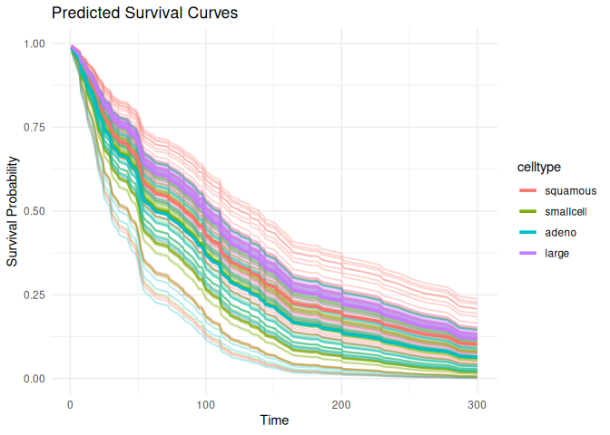

# survdnn 

> Deep Neural Networks for Survival Analysis Using
> [torch](https://torch.mlverse.org/)

[](LICENSE)  
[](https://github.com/ielbadisy/survdnn/actions/workflows/R-CMD-check.yaml)

------------------------------------------------------------------------

`survdnn` implements neural network-based models for right-censored
survival analysis using the native `torch` backend in R. It supports
multiple loss functions including Cox partial likelihood, L2-penalized
Cox, Accelerated Failure Time (AFT) objectives, as well as
time-dependent extension such as Cox-Time. The package provides a
formula interface, supports model evaluation using time-dependent
metrics (e.g., C-index, Brier score, IBS), cross-validation, and
hyperparameter tuning.

------------------------------------------------------------------------

## Features

- Formula interface for `Surv() ~ .` models
- Modular neural architectures: configurable layers, activations, and
  losses
- Built-in survival loss functions:
  - `"cox"`: Cox partial likelihood
  - `"cox_l2"`: penalized Cox
  - `"aft"`: Accelerated Failure Time
  - `"coxtime"`: deep time-dependent Cox (like DeepSurv)
- Evaluation: C-index, Brier score, Integrated Brier Score (IBS)
- Model selection with `cv_survdnn()` and `tune_survdnn()`
- Prediction of survival curves via `predict()` and `plot()`

------------------------------------------------------------------------

## Installation

``` r
# Install from GitHub
# install.packages("remotes")
remotes::install_github("ielbadisy/survdnn")

# Or clone and install locally
# git clone https://github.com/ielbadisy/survdnn.git
# setwd("survdnn")
# devtools::install()
```

------------------------------------------------------------------------

## Quick Example

``` r
library(survdnn)
library(survival, quietly = TRUE)
library(ggplot2)

veteran <- survival::veteran

mod <- survdnn(
  Surv(time, status) ~ age + karno + celltype,
  data = veteran,
  hidden = c(32, 16),
  epochs = 300,
  loss = "cox",
  verbose = TRUE
)
```

    ## Epoch 50 - Loss: 3.977111
    ## Epoch 100 - Loss: 3.931406
    ## Epoch 150 - Loss: 3.975285
    ## Epoch 200 - Loss: 3.895568
    ## Epoch 250 - Loss: 3.903689
    ## Epoch 300 - Loss: 3.893920

``` r
summary(mod)
```

    ## 

    ## ── Summary of survdnn model ──────────────────────────────────────────────────────────────────

    ## 
    ## Formula:
    ##   Surv(time, status) ~ age + karno + celltype
    ## <environment: 0x60123e5236b0>
    ## 
    ## Model architecture:
    ##   Hidden layers:  32 : 16 
    ##   Activation:  relu 
    ##   Dropout:  0.3 
    ##   Final loss:  3.893920 
    ## 
    ## Training summary:
    ##   Epochs:  300 
    ##   Learning rate:  1e-04 
    ##   Loss function:  cox 
    ## 
    ## Data summary:
    ##   Observations:  137 
    ##   Predictors:  age, karno, celltypesmallcell, celltypeadeno, celltypelarge 
    ##   Time range: [ 1, 999 ]
    ##   Event rate:  93.4%

``` r
plot(mod, group_by = "celltype", times = 1:300)
```

<!-- -->

------------------------------------------------------------------------

## Loss Functions

``` r
# Cox partial likelihood
mod1 <- survdnn(
  Surv(time, status) ~ age + karno,
  data = veteran,
  loss = "cox",
  epochs = 200
  )
```

    ## Epoch 50 - Loss: 3.960144
    ## Epoch 100 - Loss: 3.932992
    ## Epoch 150 - Loss: 3.896803
    ## Epoch 200 - Loss: 3.837747

``` r
# Accelerated Failure Time
mod2 <- survdnn(
  Surv(time, status) ~ age + karno,
  data = veteran,
  loss = "aft",
  epochs = 300
  )
```

    ## Epoch 50 - Loss: 17.780495
    ## Epoch 100 - Loss: 17.336510
    ## Epoch 150 - Loss: 17.183359
    ## Epoch 200 - Loss: 16.611074
    ## Epoch 250 - Loss: 16.427694
    ## Epoch 300 - Loss: 15.980856

``` r
# Deep time-dependent Cox (Coxtime)
mod3 <- survdnn(
  Surv(time, status) ~ age + karno,
  data = veteran,
  loss = "coxtime",
  epochs = 100
  )
```

    ## Epoch 50 - Loss: 5.174003
    ## Epoch 100 - Loss: 5.312660

------------------------------------------------------------------------

## Cross-Validation

``` r
cv_results <- cv_survdnn(
  Surv(time, status) ~ age + karno + celltype,
  data = veteran,
  times = c(30, 90, 180),
  metrics = c("cindex", "ibs"),
  folds = 3,
  hidden = c(16, 8),
  loss = "cox",
  epochs = 300
)
```

    ## Epoch 50 - Loss: 3.758594
    ## Epoch 100 - Loss: 3.658200
    ## Epoch 150 - Loss: 3.685151
    ## Epoch 200 - Loss: 3.635872
    ## Epoch 250 - Loss: 3.623964
    ## Epoch 300 - Loss: 3.580174
    ## Epoch 50 - Loss: 3.616315
    ## Epoch 100 - Loss: 3.597428
    ## Epoch 150 - Loss: 3.625255
    ## Epoch 200 - Loss: 3.597746
    ## Epoch 250 - Loss: 3.548657
    ## Epoch 300 - Loss: 3.519047
    ## Epoch 50 - Loss: 3.597470
    ## Epoch 100 - Loss: 3.568670
    ## Epoch 150 - Loss: 3.458062
    ## Epoch 200 - Loss: 3.579578
    ## Epoch 250 - Loss: 3.479793
    ## Epoch 300 - Loss: 3.500006

``` r
print(cv_results)
```

    ## # A tibble: 6 × 3
    ##    fold metric value
    ##   <int> <chr>  <dbl>
    ## 1     1 cindex 0.367
    ## 2     1 ibs    0.260
    ## 3     2 cindex 0.702
    ## 4     2 ibs    0.199
    ## 5     3 cindex 0.700
    ## 6     3 ibs    0.195

------------------------------------------------------------------------

## Hyperparameter Tuning

``` r
grid <- list(
  hidden     = list(c(16), c(32, 16)),
  lr         = c(1e-3),
  activation = c("relu"),
  epochs     = c(100, 300),
  loss       = c("cox", "aft", "coxtime")
  )

tune_res <- tune_survdnn(
  formula = Surv(time, status) ~ age + karno + celltype,
  data = veteran,
  times = c(90, 300),
  metrics = "cindex",
  param_grid = grid,
  folds = 3,
  refit = FALSE,
  return = "summary"
  )
```

    ## Epoch 50 - Loss: 15.031239
    ## Epoch 100 - Loss: 12.059148
    ## Epoch 50 - Loss: 14.047791
    ## Epoch 100 - Loss: 9.870238
    ## Epoch 50 - Loss: 15.015196
    ## Epoch 100 - Loss: 11.471657
    ## Epoch 50 - Loss: 3.376603
    ## Epoch 100 - Loss: 3.357517
    ## Epoch 50 - Loss: 3.434321
    ## Epoch 100 - Loss: 3.393324
    ## Epoch 50 - Loss: 3.465878
    ## Epoch 100 - Loss: 3.370239
    ## Epoch 50 - Loss: 4.238775
    ## Epoch 100 - Loss: 4.172030
    ## Epoch 50 - Loss: 4.403038
    ## Epoch 100 - Loss: 4.324567
    ## Epoch 50 - Loss: 4.416329
    ## Epoch 100 - Loss: 4.345415
    ## Epoch 50 - Loss: 13.701369
    ## Epoch 100 - Loss: 10.450718
    ## Epoch 150 - Loss: 7.602640
    ## Epoch 200 - Loss: 5.344359
    ## Epoch 250 - Loss: 2.948162
    ## Epoch 300 - Loss: 1.992957
    ## Epoch 50 - Loss: 15.679486
    ## Epoch 100 - Loss: 11.792761
    ## Epoch 150 - Loss: 8.836067
    ## Epoch 200 - Loss: 6.483096
    ## Epoch 250 - Loss: 4.196073
    ## Epoch 300 - Loss: 3.214763
    ## Epoch 50 - Loss: 17.787132
    ## Epoch 100 - Loss: 13.893139
    ## Epoch 150 - Loss: 10.362624
    ## Epoch 200 - Loss: 7.857927
    ## Epoch 250 - Loss: 5.187366
    ## Epoch 300 - Loss: 3.526726
    ## Epoch 50 - Loss: 3.443206
    ## Epoch 100 - Loss: 3.433463
    ## Epoch 150 - Loss: 3.337879
    ## Epoch 200 - Loss: 3.346363
    ## Epoch 250 - Loss: 3.314461
    ## Epoch 300 - Loss: 3.298452
    ## Epoch 50 - Loss: 3.449481
    ## Epoch 100 - Loss: 3.400246
    ## Epoch 150 - Loss: 3.307863
    ## Epoch 200 - Loss: 3.290303
    ## Epoch 250 - Loss: 3.360913
    ## Epoch 300 - Loss: 3.246186
    ## Epoch 50 - Loss: 3.529677
    ## Epoch 100 - Loss: 3.493235
    ## Epoch 150 - Loss: 3.415110
    ## Epoch 200 - Loss: 3.355523
    ## Epoch 250 - Loss: 3.354323
    ## Epoch 300 - Loss: 3.334403
    ## Epoch 50 - Loss: 4.423283
    ## Epoch 100 - Loss: 4.326978
    ## Epoch 150 - Loss: 4.274966
    ## Epoch 200 - Loss: 4.203520
    ## Epoch 250 - Loss: 4.176342
    ## Epoch 300 - Loss: 4.155508
    ## Epoch 50 - Loss: 4.340446
    ## Epoch 100 - Loss: 4.244659
    ## Epoch 150 - Loss: 4.172086
    ## Epoch 200 - Loss: 4.076862
    ## Epoch 250 - Loss: 4.084023
    ## Epoch 300 - Loss: 4.018843
    ## Epoch 50 - Loss: 4.537025
    ## Epoch 100 - Loss: 4.418490
    ## Epoch 150 - Loss: 4.327679
    ## Epoch 200 - Loss: 4.265956
    ## Epoch 250 - Loss: 4.242814
    ## Epoch 300 - Loss: 4.236832
    ## Epoch 50 - Loss: 17.805256
    ## Epoch 100 - Loss: 13.990833
    ## Epoch 50 - Loss: 12.508526
    ## Epoch 100 - Loss: 9.548292
    ## Epoch 50 - Loss: 11.458351
    ## Epoch 100 - Loss: 8.579316
    ## Epoch 50 - Loss: 3.437221
    ## Epoch 100 - Loss: 3.354287
    ## Epoch 50 - Loss: 3.397689
    ## Epoch 100 - Loss: 3.326006
    ## Epoch 50 - Loss: 3.456657
    ## Epoch 100 - Loss: 3.396078
    ## Epoch 50 - Loss: 4.126331
    ## Epoch 100 - Loss: 4.076169
    ## Epoch 50 - Loss: 4.233914
    ## Epoch 100 - Loss: 4.109847
    ## Epoch 50 - Loss: 4.308795
    ## Epoch 100 - Loss: 4.129897
    ## Epoch 50 - Loss: 15.970187
    ## Epoch 100 - Loss: 12.083906
    ## Epoch 150 - Loss: 9.287158
    ## Epoch 200 - Loss: 6.809984
    ## Epoch 250 - Loss: 3.800620
    ## Epoch 300 - Loss: 2.723067
    ## Epoch 50 - Loss: 13.671493
    ## Epoch 100 - Loss: 10.966175
    ## Epoch 150 - Loss: 7.848323
    ## Epoch 200 - Loss: 5.523075
    ## Epoch 250 - Loss: 3.360212
    ## Epoch 300 - Loss: 2.584748
    ## Epoch 50 - Loss: 15.246948
    ## Epoch 100 - Loss: 11.272776
    ## Epoch 150 - Loss: 8.110893
    ## Epoch 200 - Loss: 5.374218
    ## Epoch 250 - Loss: 3.830412
    ## Epoch 300 - Loss: 3.834162
    ## Epoch 50 - Loss: 3.345079
    ## Epoch 100 - Loss: 3.205394
    ## Epoch 150 - Loss: 3.264040
    ## Epoch 200 - Loss: 3.160997
    ## Epoch 250 - Loss: 3.164060
    ## Epoch 300 - Loss: 3.035522
    ## Epoch 50 - Loss: 3.425659
    ## Epoch 100 - Loss: 3.414891
    ## Epoch 150 - Loss: 3.286443
    ## Epoch 200 - Loss: 3.291998
    ## Epoch 250 - Loss: 3.266540
    ## Epoch 300 - Loss: 3.289023
    ## Epoch 50 - Loss: 3.376144
    ## Epoch 100 - Loss: 3.346564
    ## Epoch 150 - Loss: 3.312074
    ## Epoch 200 - Loss: 3.289537
    ## Epoch 250 - Loss: 3.212528
    ## Epoch 300 - Loss: 3.266787
    ## Epoch 50 - Loss: 4.174260
    ## Epoch 100 - Loss: 4.140068
    ## Epoch 150 - Loss: 4.016115
    ## Epoch 200 - Loss: 4.087175
    ## Epoch 250 - Loss: 4.005622
    ## Epoch 300 - Loss: 3.987650
    ## Epoch 50 - Loss: 4.430435
    ## Epoch 100 - Loss: 4.237810
    ## Epoch 150 - Loss: 4.187978
    ## Epoch 200 - Loss: 4.173541
    ## Epoch 250 - Loss: 4.116416
    ## Epoch 300 - Loss: 4.071148
    ## Epoch 50 - Loss: 4.222456
    ## Epoch 100 - Loss: 4.134351
    ## Epoch 150 - Loss: 4.103641
    ## Epoch 200 - Loss: 4.079398
    ## Epoch 250 - Loss: 4.105011
    ## Epoch 300 - Loss: 4.047970

``` r
print(tune_res)
```

    ## # A tibble: 12 × 8
    ##    hidden       lr activation epochs loss    metric  mean      sd
    ##    <list>    <dbl> <chr>       <dbl> <chr>   <chr>  <dbl>   <dbl>
    ##  1 <dbl [1]> 0.001 relu          100 cox     cindex 0.720 0.0593 
    ##  2 <dbl [2]> 0.001 relu          100 cox     cindex 0.715 0.0251 
    ##  3 <dbl [1]> 0.001 relu          300 aft     cindex 0.712 0.00589
    ##  4 <dbl [2]> 0.001 relu          300 cox     cindex 0.712 0.0461 
    ##  5 <dbl [1]> 0.001 relu          300 cox     cindex 0.704 0.0318 
    ##  6 <dbl [1]> 0.001 relu          300 coxtime cindex 0.704 0.0178 
    ##  7 <dbl [2]> 0.001 relu          300 aft     cindex 0.692 0.0306 
    ##  8 <dbl [1]> 0.001 relu          100 coxtime cindex 0.682 0.110  
    ##  9 <dbl [2]> 0.001 relu          300 coxtime cindex 0.670 0.0779 
    ## 10 <dbl [2]> 0.001 relu          100 aft     cindex 0.669 0.0584 
    ## 11 <dbl [2]> 0.001 relu          100 coxtime cindex 0.604 0.0323 
    ## 12 <dbl [1]> 0.001 relu          100 aft     cindex 0.559 0.0958

------------------------------------------------------------------------

## Plot Survival Curves

``` r
plot(mod1, group_by = "celltype", times = 1:300)
```

<!-- -->

``` r
plot(mod1, group_by = "celltype", times = 1:300, plot_mean_only = TRUE)
```

<!-- -->

------------------------------------------------------------------------

## Documentation

``` r
help(package = "survdnn")
?survdnn
?tune_survdnn
?cv_survdnn
?plot.survdnn
```

------------------------------------------------------------------------

## Testing

``` r
# Run all tests
devtools::test()
```

------------------------------------------------------------------------

## Contributions

Contributions, issues, and feature requests are welcome. Open an
[issue](https://github.com/ielbadisy/survdnn/issues) or submit a pull
request!

------------------------------------------------------------------------

## License

MIT © [Imad El Badisy](mailto:elbadisyimad@gmail.com)
