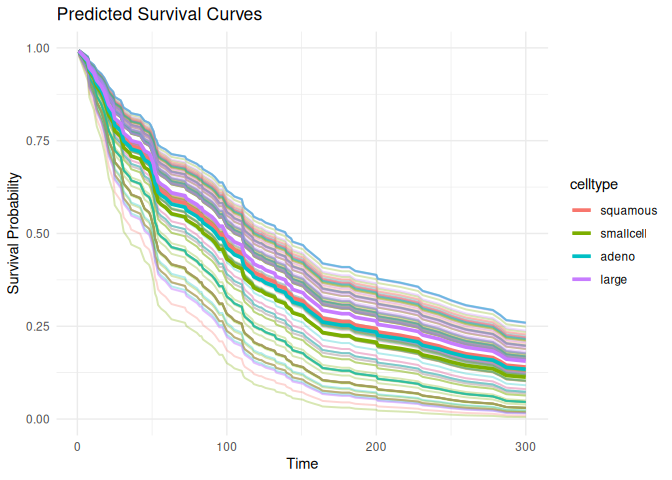
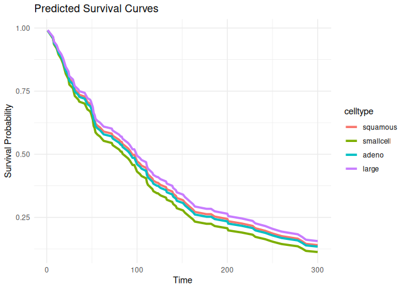

# survdnn 

> Deep Neural Networks for Survival Analysis using [R
> torch](https://torch.mlverse.org/)

[](LICENSE)  
[](https://github.com/ielbadisy/survdnn/actions/workflows/R-CMD-check.yaml)

## About

`survdnn` implements neural network-based models for right-censored
survival analysis using the native `torch` backend in R. It supports
multiple loss functions including Cox partial likelihood, L2-penalized
Cox, Accelerated Failure Time (AFT) objectives, as well as
time-dependent extension such as Cox-Time. The package provides a
formula interface, supports model evaluation using time-dependent
metrics (C-index, Brier score, IBS), cross-validation, and
hyperparameter tuning.

## Review status

A methodological paper describing the design, implementation, and
evaluation of `survdnn` is currently under review at *The R Journal*.

## Main features

- Formula interface for `Surv() ~ .` models

- Modular neural architectures: configurable layers, activations,
  optimizers, and losses

- Built-in survival loss functions:

  - `"cox"`: Cox partial likelihood
  - `"cox_l2"`: penalized Cox
  - `"aft"`: Accelerated Failure Time
  - `"coxtime"`: deep time-dependent Cox

- Evaluation: C-index, Brier score, IBS

- Model selection with `cv_survdnn()` and `tune_survdnn()`

- Prediction of survival curves via `predict()` and `plot()`

## Installation

``` r
# Install from CRAN
install.packages("survdnn")


# Install from GitHub
install.packages("remotes")
remotes::install_github("ielbadisy/survdnn")

# Or clone and install locally
git clone https://github.com/ielbadisy/survdnn.git
setwd("survdnn")
devtools::install()
```

## Quick example

``` r
library(survdnn)
library(survival, quietly = TRUE)
library(ggplot2)

veteran <- survival::veteran

mod <- survdnn(
  Surv(time, status) ~ age + karno + celltype,
  data = veteran,
  hidden = c(32, 16),
  epochs = 300,
  loss = "cox",
  verbose = TRUE
  )
```

    ## Epoch 50 - Loss: 3.967377
    ## 
    ## Epoch 100 - Loss: 3.863189
    ## 
    ## Epoch 150 - Loss: 3.879065
    ## 
    ## Epoch 200 - Loss: 3.814478
    ## 
    ## Epoch 250 - Loss: 3.756944
    ## 
    ## Epoch 300 - Loss: 3.823366

``` r
summary(mod)
```

    ## 
    ## Formula:
    ##   Surv(time, status) ~ age + karno + celltype
    ## <environment: 0x6171aa19de98>
    ## 
    ## Model architecture:
    ##   Hidden layers:  32 : 16 
    ##   Activation:  relu 
    ##   Dropout:  0.3 
    ##   Final loss:  3.823366 
    ## 
    ## Training summary:
    ##   Epochs:  300 
    ##   Learning rate:  1e-04 
    ##   Loss function:  cox 
    ##   Optimizer:  adam 
    ## 
    ## Data summary:
    ##   Observations:  137 
    ##   Predictors:  age, karno, celltypesmallcell, celltypeadeno, celltypelarge 
    ##   Time range: [ 1, 999 ]
    ##   Event rate:  93.4%

``` r
plot(mod, group_by = "celltype", times = 1:300)
```

## Loss Functions

- Cox partial likelihood

``` r
mod1 <- survdnn(
  Surv(time, status) ~ age + karno,
  data = veteran,
  loss = "cox",
  epochs = 300
  )
```

    ## Epoch 50 - Loss: 3.988259
    ## 
    ## Epoch 100 - Loss: 3.930287
    ## 
    ## Epoch 150 - Loss: 3.913787
    ## 
    ## Epoch 200 - Loss: 3.896528
    ## 
    ## Epoch 250 - Loss: 3.819792
    ## 
    ## Epoch 300 - Loss: 3.893889

- Accelerated Failure Time

``` r
mod2 <- survdnn(
  Surv(time, status) ~ age + karno,
  data = veteran,
  loss = "aft",
  epochs = 300
  )
```

    ## Epoch 50 - Loss: 16.911470
    ## 
    ## Epoch 100 - Loss: 16.589067
    ## 
    ## Epoch 150 - Loss: 16.226612
    ## 
    ## Epoch 200 - Loss: 15.959708
    ## 
    ## Epoch 250 - Loss: 15.182121
    ## 
    ## Epoch 300 - Loss: 15.049762

- Coxtime

``` r
mod3 <- survdnn(
  Surv(time, status) ~ age + karno,
  data = veteran,
  loss = "coxtime",
  epochs = 300
  )
```

    ## Epoch 50 - Loss: 4.888907
    ## 
    ## Epoch 100 - Loss: 4.846722
    ## 
    ## Epoch 150 - Loss: 4.838490
    ## 
    ## Epoch 200 - Loss: 4.816662
    ## 
    ## Epoch 250 - Loss: 4.780379
    ## 
    ## Epoch 300 - Loss: 4.756117

## Cross-validation

``` r
cv_results <- cv_survdnn(
  Surv(time, status) ~ age + karno + celltype,
  data = veteran,
  times = c(600),
  metrics = c("cindex", "ibs"),
  folds = 3,
  hidden = c(16, 8),
  loss = "cox",
  epochs = 300
  )

print(cv_results)
```

## Hyperparameter tuning

``` r
grid <- list(
  hidden     = list(c(16), c(32, 16)),
  lr         = c(1e-3),
  activation = c("relu"),
  epochs     = c(100, 300),
  loss       = c("cox", "aft", "coxtime")
  )

tune_res <- tune_survdnn(
  formula = Surv(time, status) ~ age + karno + celltype,
  data = veteran,
  times = c(90, 300),
  metrics = "cindex",
  param_grid = grid,
  folds = 3,
  refit = FALSE,
  return = "summary"
  )

print(tune_res)
```

## Tuning and refitting the best Model

`tune_survdnn()` can be used also to automatically refit the
best-performing model on the full dataset. This behavior is controlled
by the `refit` and `return` arguments. For example:

``` r
best_model <- tune_survdnn(
  formula = Surv(time, status) ~ age + karno + celltype,
  data = veteran,
  times = c(90, 300),
  metrics = "cindex",
  param_grid = grid,
  folds = 3,
  refit = TRUE,
  return = "best_model"
  )
```

In this mode, cross-validation is used to select the optimal
hyperparameter configuration, after which the selected model is refitted
on the full dataset. The function then returns a fitted object of class
`"survdnn"`.

The resulting model can be used directly for prediction visualization,
and evaluation:

``` r
summary(best_model)

plot(best_model, times = 1:300)

predict(best_model, veteran, type = "risk", times = 180)
```

This makes `tune_survdnn()` suitable for end-to-end workflows, combining
model selection and final model fitting.

## Plot survival curves

``` r
plot(mod1, group_by = "celltype", times = 1:300)
```

<!-- -->

``` r
plot(mod1, group_by = "celltype", times = 1:300, plot_mean_only = TRUE)
```

<!-- -->

## Documentation

``` r
help(package = "survdnn")
?survdnn
?tune_survdnn
?cv_survdnn
?plot.survdnn
```

## Testing

``` r
# run all tests
devtools::test()
```

## Note on reproducibility

By default, `{torch}` initializes model weights and shuffles minibatches
using random draws, so results may differ across runs. Unlike
`set.seed()`, which only controls R’s random number generator, `{torch}`
relies on its own RNG implemented in C++ (and CUDA when using GPUs).

To ensure reproducibility, random seeds must therefore be set at the
Torch level as well.

`survdnn` provides built-in control of randomness to guarantee
reproducible results across runs. The main fitting function,
`survdnn()`, exposes a dedicated `.seed` argument:

``` r
mod <- survdnn(
  Surv(time, status) ~ age + karno + celltype,
  data   = veteran,
  epochs = 300,
  .seed  = 123
)
```

When `.seed` is provided, `survdnn()` internally synchronizes both R and
Torch random number generators via `survdnn_set_seed()`, ensuring
reproducible:

- weight initialization

- dropout behavior

- minibatch ordering

- loss trajectories

If `.seed = NULL` (the default), randomness is left uncontrolled and
results may vary between runs.

For full reproducibility in cross-validation or hyperparameter tuning,
the same `.seed` mechanism is propagated internally by `cv_survdnn()`
and `tune_survdnn()`, ensuring consistent data splits, model
initialization, and optimization paths across repetitions.

## CPU and core usage

`survdnn` relies on the `{torch}` backend for numerical computation. The
number of CPU cores (threads) used during training, prediction, and
evaluation is controlled globally by Torch.

By default, Torch automatically configures its CPU thread pools based on
the available system resources, unless explicitly overridden by the user
using:

``` r
torch::torch_set_num_threads(4)
```

This setting affects:

- model training

- prediction

- evaluation metrics

- cross-validation and hyperparameter tuning

GPU acceleration can be enabled by setting `.device = "cuda"` when
calling `survdnn()` (`cv_survdnn()` and `tune_survdnn()` too).

## Availability

The `survdnn` R package is available on
[CRAN](https://CRAN.R-project.org/package=survdnn) or
[github](https://github.com/ielbadisy/survdnn)

## Contributions

Contributions, issues, and feature requests are welcome!

Open an [issue](https://github.com/ielbadisy/survdnn/issues) or submit a
pull request.

## License

MIT License © 2025 Imad EL BADISY
