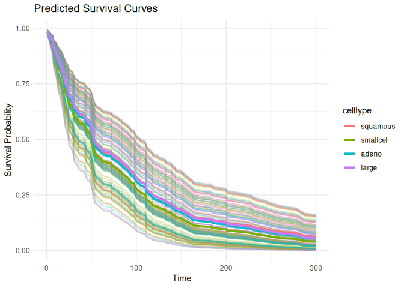

# survdnn 

> Deep Neural Networks for Survival Analysis Using
> [torch](https://torch.mlverse.org/)

[](LICENSE)  
[](https://github.com/ielbadisy/survdnn/actions/workflows/R-CMD-check.yaml)

------------------------------------------------------------------------

`survdnn` implements neural network-based models for right-censored
survival analysis using the native `torch` backend in R. It supports
multiple loss functions including Cox partial likelihood, L2-penalized
Cox, Accelerated Failure Time (AFT) objectives, as well as
time-dependent extension such as Cox-Time. The package provides a
formula interface, supports model evaluation using time-dependent
metrics (e.g., C-index, Brier score, IBS), cross-validation, and
hyperparameter tuning.

------------------------------------------------------------------------

## Features

- Formula interface for `Surv() ~ .` models
- Modular neural architectures: configurable layers, activations, and
  losses
- Built-in survival loss functions:
  - `"cox"`: Cox partial likelihood
  - `"cox_l2"`: penalized Cox
  - `"aft"`: Accelerated Failure Time
  - `"coxtime"`: deep time-dependent Cox (like DeepSurv)
- Evaluation: C-index, Brier score, Integrated Brier Score (IBS)
- Model selection with `cv_survdnn()` and `tune_survdnn()`
- Prediction of survival curves via `predict()` and `plot()`

------------------------------------------------------------------------

## Installation

``` r
# Install from GitHub
# install.packages("remotes")
remotes::install_github("ielbadisy/survdnn")

# Or clone and install locally
# git clone https://github.com/ielbadisy/survdnn.git
# setwd("survdnn")
# devtools::install()
```

------------------------------------------------------------------------

## Quick Example

``` r
library(survdnn)
library(survival, quietly = TRUE)
```

    ## 
    ## Attaching package: 'survival'

    ## The following object is masked from 'package:survdnn':
    ## 
    ##     brier

``` r
library(ggplot2)

veteran <- survival::veteran
mod <- survdnn(
  Surv(time, status) ~ age + karno + celltype,
  data = veteran,
  hidden = c(32, 16),
  epochs = 300,
  loss = "cox",
  verbose = TRUE
)
```

    ## Epoch 50 - Loss: 3.977486
    ## Epoch 100 - Loss: 3.964091
    ## Epoch 150 - Loss: 3.884193
    ## Epoch 200 - Loss: 3.901107
    ## Epoch 250 - Loss: 3.903059
    ## Epoch 300 - Loss: 3.834641

``` r
summary(mod)
```

    ## 

    ## ── Summary of survdnn model ────────────────────────────────────────────────────────────────────

    ## 
    ## Formula:
    ##   Surv(time, status) ~ age + karno + celltype
    ## <environment: 0x583ba51e52f8>
    ## 
    ## Model architecture:
    ##   Hidden layers:  32 : 16 
    ##   Activation:  relu 
    ##   Dropout:  0.3 
    ##   Final loss:  3.834641 
    ## 
    ## Training summary:
    ##   Epochs:  300 
    ##   Learning rate:  1e-04 
    ##   Loss function:  cox 
    ## 
    ## Data summary:
    ##   Observations:  137 
    ##   Predictors:  age, karno, celltypesmallcell, celltypeadeno, celltypelarge 
    ##   Time range: [ 1, 999 ]
    ##   Event rate:  93.4%

``` r
plot(mod, group_by = "celltype", times = 1:300)
```

<!-- -->

------------------------------------------------------------------------

## Loss Functions

``` r
# Cox partial likelihood
mod1 <- survdnn(
  Surv(time, status) ~ age + karno,
  data = veteran,
  loss = "cox",
  epochs = 100
)
```

    ## Epoch 50 - Loss: 3.881097
    ## Epoch 100 - Loss: 3.943323

``` r
# Accelerated Failure Time
mod2 <- survdnn(
  Surv(time, status) ~ age + karno,
  data = veteran,
  loss = "aft",
  epochs = 100
)
```

    ## Epoch 50 - Loss: 17.080214
    ## Epoch 100 - Loss: 16.353647

``` r
# Deep time-dependent Cox (Coxtime)
mod3 <- survdnn(
  Surv(time, status) ~ age + karno,
  data = veteran,
  loss = "coxtime",
  epochs = 100
)
```

    ## Epoch 50 - Loss: 4.919549
    ## Epoch 100 - Loss: 4.968542

------------------------------------------------------------------------

## Cross-Validation

``` r
cv_results <- cv_survdnn(
  Surv(time, status) ~ age + karno + celltype,
  data = veteran,
  times = c(30, 90, 180),
  metrics = c("cindex", "ibs"),
  folds = 3,
  hidden = c(16, 8),
  loss = "cox",
  epochs = 100
)
```

    ## Epoch 50 - Loss: 3.685887
    ## Epoch 100 - Loss: 3.643225
    ## Epoch 50 - Loss: 3.601465
    ## Epoch 100 - Loss: 3.593301
    ## Epoch 50 - Loss: 3.640470
    ## Epoch 100 - Loss: 3.637941

``` r
print(cv_results)
```

    ## # A tibble: 6 × 3
    ##    fold metric value
    ##   <int> <chr>  <dbl>
    ## 1     1 cindex 0.451
    ## 2     1 ibs    0.256
    ## 3     2 cindex 0.672
    ## 4     2 ibs    0.202
    ## 5     3 cindex 0.546
    ## 6     3 ibs    0.224

------------------------------------------------------------------------

## Hyperparameter Tuning

``` r
grid <- list(
  hidden     = list(c(16), c(32, 16)),
  lr         = c(1e-3),
  activation = c("relu"),
  epochs     = c(100),
  loss       = c("cox", "aft")
)

tune_res <- tune_survdnn(
  formula = Surv(time, status) ~ age + karno + celltype,
  data = veteran,
  times = c(90, 300),
  metrics = "cindex",
  param_grid = grid,
  folds = 3,
  refit = FALSE,
  return = "summary"
)
```

    ## Epoch 50 - Loss: 14.573132
    ## Epoch 100 - Loss: 11.292369
    ## Epoch 50 - Loss: 15.591273
    ## Epoch 100 - Loss: 12.278717
    ## Epoch 50 - Loss: 16.437584
    ## Epoch 100 - Loss: 13.317498
    ## Epoch 50 - Loss: 3.540871
    ## Epoch 100 - Loss: 3.457459
    ## Epoch 50 - Loss: 3.485572
    ## Epoch 100 - Loss: 3.389402
    ## Epoch 50 - Loss: 3.439479
    ## Epoch 100 - Loss: 3.356264
    ## Epoch 50 - Loss: 14.920561
    ## Epoch 100 - Loss: 12.463149
    ## Epoch 50 - Loss: 14.736887
    ## Epoch 100 - Loss: 11.081664
    ## Epoch 50 - Loss: 11.418893
    ## Epoch 100 - Loss: 8.095353
    ## Epoch 50 - Loss: 3.291874
    ## Epoch 100 - Loss: 3.256801
    ## Epoch 50 - Loss: 3.439318
    ## Epoch 100 - Loss: 3.387714
    ## Epoch 50 - Loss: 3.438096
    ## Epoch 100 - Loss: 3.354662

``` r
print(tune_res)
```

    ## # A tibble: 4 × 8
    ##   hidden       lr activation epochs loss  metric  mean     sd
    ##   <list>    <dbl> <chr>       <dbl> <chr> <chr>  <dbl>  <dbl>
    ## 1 <dbl [1]> 0.001 relu          100 cox   cindex 0.741 0.0561
    ## 2 <dbl [2]> 0.001 relu          100 cox   cindex 0.741 0.0283
    ## 3 <dbl [2]> 0.001 relu          100 aft   cindex 0.677 0.0131
    ## 4 <dbl [1]> 0.001 relu          100 aft   cindex 0.574 0.0980

------------------------------------------------------------------------

## Plot Survival Curves

``` r
plot(mod1, group_by = "celltype", times = 1:300)
```

<!-- -->

``` r
plot(mod1, group_by = "celltype", times = 1:300, plot_mean_only = TRUE)
```

<!-- -->

------------------------------------------------------------------------

## Documentation

``` r
help(package = "survdnn")
?survdnn
?tune_survdnn
?cv_survdnn
?plot.survdnn
```

------------------------------------------------------------------------

## Testing

``` r
# Run all tests
devtools::test()
```

------------------------------------------------------------------------

## Contributions

Contributions, issues, and feature requests are welcome. Open an
[issue](https://github.com/ielbadisy/survdnn/issues) or submit a pull
request!

------------------------------------------------------------------------

## License

MIT © [Imad El Badisy](mailto:elbadisyimad@gmail.com)
