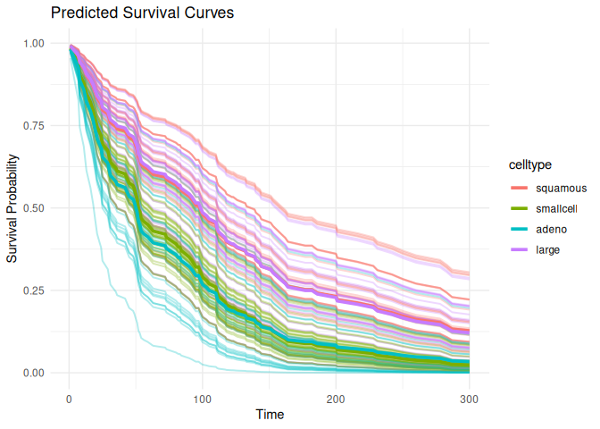

# survdnn 

> Deep Neural Networks for Survival Analysis Using
> [torch](https://torch.mlverse.org/)

[](LICENSE)  
[](https://github.com/ielbadisy/survdnn/actions/workflows/R-CMD-check.yaml)

------------------------------------------------------------------------

`survdnn` implements neural network-based models for right-censored
survival analysis using the native `torch` backend in R. It supports
multiple loss functions including Cox partial likelihood, L2-penalized
Cox, Accelerated Failure Time (AFT) objectives, as well as
time-dependent extension such as Cox-Time. The package provides a
formula interface, supports model evaluation using time-dependent
metrics (e.g., C-index, Brier score, IBS), cross-validation, and
hyperparameter tuning.

------------------------------------------------------------------------

## Features

- Formula interface for `Surv() ~ .` models
- Modular neural architectures: configurable layers, activations, and
  losses
- Built-in survival loss functions:
  - `"cox"`: Cox partial likelihood
  - `"cox_l2"`: penalized Cox
  - `"aft"`: Accelerated Failure Time
  - `"coxtime"`: deep time-dependent Cox (like DeepSurv)
- Evaluation: C-index, Brier score, Integrated Brier Score (IBS)
- Model selection with `cv_survdnn()` and `tune_survdnn()`
- Prediction of survival curves via `predict()` and `plot()`

------------------------------------------------------------------------

## Installation

``` r
# Install from GitHub
# install.packages("remotes")
remotes::install_github("ielbadisy/survdnn")

# Or clone and install locally
# git clone https://github.com/ielbadisy/survdnn.git
# setwd("survdnn")
# devtools::install()
```

------------------------------------------------------------------------

## Quick Example

``` r
library(survdnn)
library(survival, quietly = TRUE)
```

    ## 
    ## Attaching package: 'survival'

    ## The following object is masked from 'package:survdnn':
    ## 
    ##     brier

``` r
library(ggplot2)

veteran <- survival::veteran
mod <- survdnn(
  Surv(time, status) ~ age + karno + celltype,
  data = veteran,
  hidden = c(32, 16),
  epochs = 300,
  loss = "cox",
  verbose = TRUE
)
```

    ## Epoch 50 - Loss: 3.920407
    ## Epoch 100 - Loss: 3.884368
    ## Epoch 150 - Loss: 3.921844
    ## Epoch 200 - Loss: 3.900048
    ## Epoch 250 - Loss: 3.861905
    ## Epoch 300 - Loss: 3.812216

``` r
summary(mod)
```

    ## 

    ## ── Summary of survdnn model ──────────────────────────────────────────────────────

    ## 
    ## Formula:
    ##   Surv(time, status) ~ age + karno + celltype
    ## <environment: 0x610ec4300d10>
    ## 
    ## Model architecture:
    ##   Hidden layers:  32 : 16 
    ##   Activation:  relu 
    ##   Dropout:  0.3 
    ##   Final loss:  3.812216 
    ## 
    ## Training summary:
    ##   Epochs:  300 
    ##   Learning rate:  1e-04 
    ##   Loss function:  cox 
    ## 
    ## Data summary:
    ##   Observations:  137 
    ##   Predictors:  age, karno, celltypesmallcell, celltypeadeno, celltypelarge 
    ##   Time range: [ 1, 999 ]
    ##   Event rate:  93.4%

``` r
plot(mod, group_by = "celltype", times = 1:300)
```

<!-- -->

------------------------------------------------------------------------

## Loss Functions

``` r
# Cox partial likelihood
mod1 <- survdnn(
  Surv(time, status) ~ age + karno,
  data = veteran,
  loss = "cox",
  epochs = 200
)
```

    ## Epoch 50 - Loss: 3.892572
    ## Epoch 100 - Loss: 3.928978
    ## Epoch 150 - Loss: 3.874629
    ## Epoch 200 - Loss: 3.818594

``` r
# Accelerated Failure Time
mod2 <- survdnn(
  Surv(time, status) ~ age + karno,
  data = veteran,
  loss = "aft",
  epochs = 300
)
```

    ## Epoch 50 - Loss: 18.533104
    ## Epoch 100 - Loss: 18.249041
    ## Epoch 150 - Loss: 17.746975
    ## Epoch 200 - Loss: 17.661713
    ## Epoch 250 - Loss: 17.095573
    ## Epoch 300 - Loss: 16.140587

``` r
# Deep time-dependent Cox (Coxtime)
mod3 <- survdnn(
  Surv(time, status) ~ age + karno,
  data = veteran,
  loss = "coxtime",
  epochs = 100
)
```

    ## Epoch 50 - Loss: 4.771439
    ## Epoch 100 - Loss: 4.723246

------------------------------------------------------------------------

## Cross-Validation

``` r
cv_results <- cv_survdnn(
  Surv(time, status) ~ age + karno + celltype,
  data = veteran,
  times = c(30, 90, 180),
  metrics = c("cindex", "ibs"),
  folds = 3,
  hidden = c(16, 8),
  loss = "cox",
  epochs = 300
)
```

    ## Epoch 50 - Loss: 3.576534
    ## Epoch 100 - Loss: 3.549371
    ## Epoch 150 - Loss: 3.555541
    ## Epoch 200 - Loss: 3.537020
    ## Epoch 250 - Loss: 3.525653
    ## Epoch 300 - Loss: 3.529879
    ## Epoch 50 - Loss: 3.536667
    ## Epoch 100 - Loss: 3.609215
    ## Epoch 150 - Loss: 3.663316
    ## Epoch 200 - Loss: 3.540290
    ## Epoch 250 - Loss: 3.556109
    ## Epoch 300 - Loss: 3.591716
    ## Epoch 50 - Loss: 3.586503
    ## Epoch 100 - Loss: 3.679306
    ## Epoch 150 - Loss: 3.551113
    ## Epoch 200 - Loss: 3.550709
    ## Epoch 250 - Loss: 3.569376
    ## Epoch 300 - Loss: 3.515862

``` r
print(cv_results)
```

    ## # A tibble: 6 × 3
    ##    fold metric value
    ##   <int> <chr>  <dbl>
    ## 1     1 cindex 0.702
    ## 2     1 ibs    0.202
    ## 3     2 cindex 0.664
    ## 4     2 ibs    0.187
    ## 5     3 cindex 0.729
    ## 6     3 ibs    0.186

------------------------------------------------------------------------

## Hyperparameter Tuning

``` r
grid <- list(
  hidden     = list(c(16), c(32, 16)),
  lr         = c(1e-3),
  activation = c("relu"),
  epochs     = c(100, 300),
  loss       = c("cox", "aft", "coxtime")
)

tune_res <- tune_survdnn(
  formula = Surv(time, status) ~ age + karno + celltype,
  data = veteran,
  times = c(90, 300),
  metrics = "cindex",
  param_grid = grid,
  folds = 3,
  refit = FALSE,
  return = "summary"
)
```

    ## Epoch 50 - Loss: 12.328460
    ## Epoch 100 - Loss: 9.065620
    ## Epoch 50 - Loss: 15.578395
    ## Epoch 100 - Loss: 11.789577
    ## Epoch 50 - Loss: 12.991719
    ## Epoch 100 - Loss: 9.633801
    ## Epoch 50 - Loss: 3.480475
    ## Epoch 100 - Loss: 3.363773
    ## Epoch 50 - Loss: 3.484061
    ## Epoch 100 - Loss: 3.415394
    ## Epoch 50 - Loss: 3.516279
    ## Epoch 100 - Loss: 3.405664
    ## Epoch 50 - Loss: 4.290106
    ## Epoch 100 - Loss: 4.249128
    ## Epoch 50 - Loss: 4.339831
    ## Epoch 100 - Loss: 4.265162
    ## Epoch 50 - Loss: 4.362686
    ## Epoch 100 - Loss: 4.250999
    ## Epoch 50 - Loss: 19.406496
    ## Epoch 100 - Loss: 15.439429
    ## Epoch 150 - Loss: 12.528613
    ## Epoch 200 - Loss: 9.284315
    ## Epoch 250 - Loss: 6.323439
    ## Epoch 300 - Loss: 5.834066
    ## Epoch 50 - Loss: 13.236552
    ## Epoch 100 - Loss: 10.628658
    ## Epoch 150 - Loss: 7.754280
    ## Epoch 200 - Loss: 5.962394
    ## Epoch 250 - Loss: 3.926112
    ## Epoch 300 - Loss: 2.904611
    ## Epoch 50 - Loss: 11.801052
    ## Epoch 100 - Loss: 8.345713
    ## Epoch 150 - Loss: 5.476639
    ## Epoch 200 - Loss: 3.455716
    ## Epoch 250 - Loss: 3.582708
    ## Epoch 300 - Loss: 2.381281
    ## Epoch 50 - Loss: 3.422476
    ## Epoch 100 - Loss: 3.367048
    ## Epoch 150 - Loss: 3.364307
    ## Epoch 200 - Loss: 3.321339
    ## Epoch 250 - Loss: 3.417422
    ## Epoch 300 - Loss: 3.261798
    ## Epoch 50 - Loss: 3.449943
    ## Epoch 100 - Loss: 3.363387
    ## Epoch 150 - Loss: 3.302153
    ## Epoch 200 - Loss: 3.265188
    ## Epoch 250 - Loss: 3.195902
    ## Epoch 300 - Loss: 3.210111
    ## Epoch 50 - Loss: 3.454362
    ## Epoch 100 - Loss: 3.401748
    ## Epoch 150 - Loss: 3.324684
    ## Epoch 200 - Loss: 3.329819
    ## Epoch 250 - Loss: 3.378384
    ## Epoch 300 - Loss: 3.339173
    ## Epoch 50 - Loss: 4.332293
    ## Epoch 100 - Loss: 4.281866
    ## Epoch 150 - Loss: 4.200024
    ## Epoch 200 - Loss: 4.126455
    ## Epoch 250 - Loss: 4.087531
    ## Epoch 300 - Loss: 4.076457
    ## Epoch 50 - Loss: 4.314804
    ## Epoch 100 - Loss: 4.214521
    ## Epoch 150 - Loss: 4.117031
    ## Epoch 200 - Loss: 4.095285
    ## Epoch 250 - Loss: 4.042738
    ## Epoch 300 - Loss: 4.010233
    ## Epoch 50 - Loss: 4.469543
    ## Epoch 100 - Loss: 4.354007
    ## Epoch 150 - Loss: 4.270033
    ## Epoch 200 - Loss: 4.243079
    ## Epoch 250 - Loss: 4.166446
    ## Epoch 300 - Loss: 4.151458
    ## Epoch 50 - Loss: 16.672979
    ## Epoch 100 - Loss: 12.563848
    ## Epoch 50 - Loss: 11.140794
    ## Epoch 100 - Loss: 7.947315
    ## Epoch 50 - Loss: 13.688748
    ## Epoch 100 - Loss: 10.438493
    ## Epoch 50 - Loss: 3.369597
    ## Epoch 100 - Loss: 3.273474
    ## Epoch 50 - Loss: 3.394081
    ## Epoch 100 - Loss: 3.318033
    ## Epoch 50 - Loss: 3.407690
    ## Epoch 100 - Loss: 3.336821
    ## Epoch 50 - Loss: 4.197709
    ## Epoch 100 - Loss: 4.139091
    ## Epoch 50 - Loss: 4.199408
    ## Epoch 100 - Loss: 4.123789
    ## Epoch 50 - Loss: 4.207206
    ## Epoch 100 - Loss: 4.117700
    ## Epoch 50 - Loss: 16.992088
    ## Epoch 100 - Loss: 13.955168
    ## Epoch 150 - Loss: 10.641459
    ## Epoch 200 - Loss: 8.543183
    ## Epoch 250 - Loss: 6.259253
    ## Epoch 300 - Loss: 3.670302
    ## Epoch 50 - Loss: 12.386081
    ## Epoch 100 - Loss: 9.393865
    ## Epoch 150 - Loss: 6.205332
    ## Epoch 200 - Loss: 4.283344
    ## Epoch 250 - Loss: 2.977871
    ## Epoch 300 - Loss: 2.183104
    ## Epoch 50 - Loss: 14.464177
    ## Epoch 100 - Loss: 11.538087
    ## Epoch 150 - Loss: 8.524919
    ## Epoch 200 - Loss: 5.294012
    ## Epoch 250 - Loss: 4.776147
    ## Epoch 300 - Loss: 2.993745
    ## Epoch 50 - Loss: 3.282586
    ## Epoch 100 - Loss: 3.213423
    ## Epoch 150 - Loss: 3.234052
    ## Epoch 200 - Loss: 3.187951
    ## Epoch 250 - Loss: 3.153610
    ## Epoch 300 - Loss: 3.145502
    ## Epoch 50 - Loss: 3.411296
    ## Epoch 100 - Loss: 3.475694
    ## Epoch 150 - Loss: 3.286752
    ## Epoch 200 - Loss: 3.335254
    ## Epoch 250 - Loss: 3.227865
    ## Epoch 300 - Loss: 3.269210
    ## Epoch 50 - Loss: 3.362057
    ## Epoch 100 - Loss: 3.375836
    ## Epoch 150 - Loss: 3.284926
    ## Epoch 200 - Loss: 3.302031
    ## Epoch 250 - Loss: 3.266161
    ## Epoch 300 - Loss: 3.324124
    ## Epoch 50 - Loss: 4.304831
    ## Epoch 100 - Loss: 4.218254
    ## Epoch 150 - Loss: 4.132638
    ## Epoch 200 - Loss: 4.081973
    ## Epoch 250 - Loss: 4.058081
    ## Epoch 300 - Loss: 3.984899
    ## Epoch 50 - Loss: 4.253399
    ## Epoch 100 - Loss: 4.106722
    ## Epoch 150 - Loss: 4.070873
    ## Epoch 200 - Loss: 4.051429
    ## Epoch 250 - Loss: 4.047535
    ## Epoch 300 - Loss: 4.056719
    ## Epoch 50 - Loss: 4.300644
    ## Epoch 100 - Loss: 4.178752
    ## Epoch 150 - Loss: 4.111469
    ## Epoch 200 - Loss: 4.089806
    ## Epoch 250 - Loss: 4.058856
    ## Epoch 300 - Loss: 4.063814

``` r
print(tune_res)
```

    ## # A tibble: 12 × 8
    ##    hidden       lr activation epochs loss    metric  mean     sd
    ##    <list>    <dbl> <chr>       <dbl> <chr>   <chr>  <dbl>  <dbl>
    ##  1 <dbl [2]> 0.001 relu          100 cox     cindex 0.726 0.0150
    ##  2 <dbl [2]> 0.001 relu          300 cox     cindex 0.711 0.0557
    ##  3 <dbl [1]> 0.001 relu          100 cox     cindex 0.710 0.0495
    ##  4 <dbl [2]> 0.001 relu          300 aft     cindex 0.707 0.0353
    ##  5 <dbl [1]> 0.001 relu          300 cox     cindex 0.707 0.0246
    ##  6 <dbl [1]> 0.001 relu          300 coxtime cindex 0.701 0.0345
    ##  7 <dbl [1]> 0.001 relu          300 aft     cindex 0.700 0.0386
    ##  8 <dbl [2]> 0.001 relu          300 coxtime cindex 0.677 0.0898
    ##  9 <dbl [2]> 0.001 relu          100 aft     cindex 0.677 0.0628
    ## 10 <dbl [1]> 0.001 relu          100 coxtime cindex 0.629 0.0379
    ## 11 <dbl [2]> 0.001 relu          100 coxtime cindex 0.618 0.0628
    ## 12 <dbl [1]> 0.001 relu          100 aft     cindex 0.532 0.136

------------------------------------------------------------------------

## Plot Survival Curves

``` r
plot(mod1, group_by = "celltype", times = 1:300)
```

<!-- -->

``` r
plot(mod1, group_by = "celltype", times = 1:300, plot_mean_only = TRUE)
```

<!-- -->

------------------------------------------------------------------------

## Documentation

``` r
help(package = "survdnn")
?survdnn
?tune_survdnn
?cv_survdnn
?plot.survdnn
```

------------------------------------------------------------------------

## Testing

``` r
# Run all tests
devtools::test()
```

------------------------------------------------------------------------

## Contributions

Contributions, issues, and feature requests are welcome. Open an
[issue](https://github.com/ielbadisy/survdnn/issues) or submit a pull
request!

------------------------------------------------------------------------

## License

MIT © [Imad El Badisy](mailto:elbadisyimad@gmail.com)
