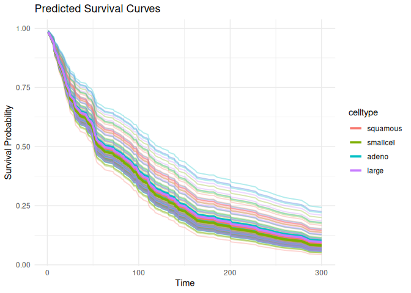
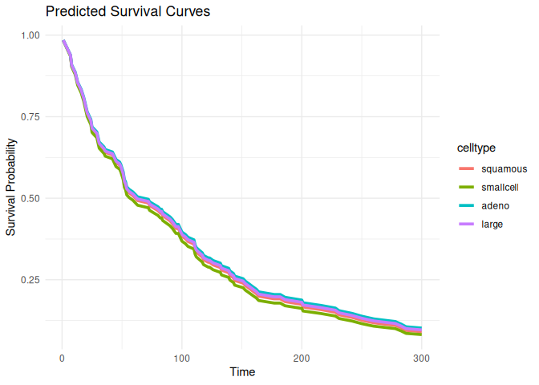

# survdnn 

> Deep Neural Networks for Survival Analysis Using
> [torch](https://torch.mlverse.org/)

[](LICENSE)  
[](https://github.com/ielbadisy/survdnn/actions/workflows/R-CMD-check.yaml)

------------------------------------------------------------------------

`survdnn` implements neural network-based models for right-censored
survival analysis using the native `torch` backend in R. It supports
multiple loss functions including Cox partial likelihood, L2-penalized
Cox, Accelerated Failure Time (AFT) objectives, as well as
time-dependent extension such as Cox-Time. The package provides a
formula interface, supports model evaluation using time-dependent
metrics (e.g., C-index, Brier score, IBS), cross-validation, and
hyperparameter tuning.

------------------------------------------------------------------------

## Features

- Formula interface for `Surv() ~ .` models
- Modular neural architectures: configurable layers, activations, and
  losses
- Built-in survival loss functions:
  - `"cox"`: Cox partial likelihood
  - `"cox_l2"`: penalized Cox
  - `"aft"`: Accelerated Failure Time
  - `"coxtime"`: deep time-dependent Cox (like DeepSurv)
- Evaluation: C-index, Brier score, Integrated Brier Score (IBS)
- Model selection with `cv_survdnn()` and `tune_survdnn()`
- Prediction of survival curves via `predict()` and `plot()`

------------------------------------------------------------------------

## Installation

``` r
# Install from GitHub
# install.packages("remotes")
remotes::install_github("ielbadisy/survdnn")

# Or clone and install locally
# git clone https://github.com/ielbadisy/survdnn.git
# setwd("survdnn")
# devtools::install()
```

------------------------------------------------------------------------

## Quick Example

``` r
library(survdnn)
library(survival, quietly = TRUE)
library(ggplot2)

veteran <- survival::veteran

mod <- survdnn(
  Surv(time, status) ~ age + karno + celltype,
  data = veteran,
  hidden = c(32, 16),
  epochs = 100,
  loss = "cox",
  verbose = TRUE
)
```

    ## Epoch 50 - Loss: 3.991001
    ## Epoch 100 - Loss: 3.895469

``` r
summary(mod)
```

    ## 

    ## ── Summary of survdnn model ────────────────────────────────

    ## 
    ## Formula:
    ##   Surv(time, status) ~ age + karno + celltype
    ## <environment: 0x60dbe1e1e070>
    ## 
    ## Model architecture:
    ##   Hidden layers:  32 : 16 
    ##   Activation:  relu 
    ##   Dropout:  0.3 
    ##   Final loss:  3.895469 
    ## 
    ## Training summary:
    ##   Epochs:  100 
    ##   Learning rate:  1e-04 
    ##   Loss function:  cox 
    ## 
    ## Data summary:
    ##   Observations:  137 
    ##   Predictors:  age, karno, celltypesmallcell, celltypeadeno, celltypelarge 
    ##   Time range: [ 1, 999 ]
    ##   Event rate:  93.4%

``` r
plot(mod, group_by = "celltype", times = 1:300)
```

<!-- -->

------------------------------------------------------------------------

## Loss Functions

``` r
# Cox partial likelihood
mod1 <- survdnn(
  Surv(time, status) ~ age + karno,
  data = veteran,
  loss = "cox",
  epochs = 100
  )
```

    ## Epoch 50 - Loss: 3.977041
    ## Epoch 100 - Loss: 3.874851

``` r
# Accelerated Failure Time
mod2 <- survdnn(
  Surv(time, status) ~ age + karno,
  data = veteran,
  loss = "aft",
  epochs = 100
  )
```

    ## Epoch 50 - Loss: 17.498917
    ## Epoch 100 - Loss: 17.225241

``` r
# Deep time-dependent Cox (Coxtime)
mod3 <- survdnn(
  Surv(time, status) ~ age + karno,
  data = veteran,
  loss = "coxtime",
  epochs = 100
  )
```

    ## Epoch 50 - Loss: 4.813874
    ## Epoch 100 - Loss: 4.765813

------------------------------------------------------------------------

## Cross-Validation

``` r
cv_results <- cv_survdnn(
  Surv(time, status) ~ age + karno + celltype,
  data = veteran,
  times = c(30, 90, 180),
  metrics = c("cindex", "ibs"),
  folds = 3,
  hidden = c(16, 8),
  loss = "cox",
  epochs = 100
)
```

    ## Epoch 50 - Loss: 3.518623
    ## Epoch 100 - Loss: 3.514367
    ## Epoch 50 - Loss: 3.623548
    ## Epoch 100 - Loss: 3.516499
    ## Epoch 50 - Loss: 3.689082
    ## Epoch 100 - Loss: 3.587547

``` r
print(cv_results)
```

    ## # A tibble: 6 × 3
    ##    fold metric value
    ##   <int> <chr>  <dbl>
    ## 1     1 cindex 0.563
    ## 2     1 ibs    0.256
    ## 3     2 cindex 0.646
    ## 4     2 ibs    0.213
    ## 5     3 cindex 0.569
    ## 6     3 ibs    0.237

------------------------------------------------------------------------

## Hyperparameter Tuning

``` r
grid <- list(
  hidden     = list(c(16), c(32, 16)),
  lr         = c(1e-3),
  activation = c("relu"),
  epochs     = c(100, 300),
  loss       = c("cox", "aft", "coxtime")
  )

tune_res <- tune_survdnn(
  formula = Surv(time, status) ~ age + karno + celltype,
  data = veteran,
  times = c(90, 300),
  metrics = "cindex",
  param_grid = grid,
  folds = 3,
  refit = FALSE,
  return = "summary"
  )
```

    ## Epoch 50 - Loss: 15.543293
    ## Epoch 100 - Loss: 12.008818
    ## Epoch 50 - Loss: 14.532288
    ## Epoch 100 - Loss: 11.390849
    ## Epoch 50 - Loss: 14.347825
    ## Epoch 100 - Loss: 11.387609
    ## Epoch 50 - Loss: 3.308374
    ## Epoch 100 - Loss: 3.243330
    ## Epoch 50 - Loss: 3.448358
    ## Epoch 100 - Loss: 3.431431
    ## Epoch 50 - Loss: 3.367062
    ## Epoch 100 - Loss: 3.289885
    ## Epoch 50 - Loss: 4.270097
    ## Epoch 100 - Loss: 4.167840
    ## Epoch 50 - Loss: 4.327861
    ## Epoch 100 - Loss: 4.229064
    ## Epoch 50 - Loss: 4.430434
    ## Epoch 100 - Loss: 4.317451
    ## Epoch 50 - Loss: 13.123316
    ## Epoch 100 - Loss: 9.897635
    ## Epoch 150 - Loss: 7.049804
    ## Epoch 200 - Loss: 4.567836
    ## Epoch 250 - Loss: 2.995900
    ## Epoch 300 - Loss: 2.928713
    ## Epoch 50 - Loss: 16.225830
    ## Epoch 100 - Loss: 12.374308
    ## Epoch 150 - Loss: 9.200141
    ## Epoch 200 - Loss: 6.134055
    ## Epoch 250 - Loss: 4.094598
    ## Epoch 300 - Loss: 2.338255
    ## Epoch 50 - Loss: 14.777921
    ## Epoch 100 - Loss: 11.133040
    ## Epoch 150 - Loss: 8.188516
    ## Epoch 200 - Loss: 6.173800
    ## Epoch 250 - Loss: 4.417482
    ## Epoch 300 - Loss: 3.145138
    ## Epoch 50 - Loss: 3.434340
    ## Epoch 100 - Loss: 3.363403
    ## Epoch 150 - Loss: 3.422523
    ## Epoch 200 - Loss: 3.266015
    ## Epoch 250 - Loss: 3.310525
    ## Epoch 300 - Loss: 3.233700
    ## Epoch 50 - Loss: 3.372238
    ## Epoch 100 - Loss: 3.338603
    ## Epoch 150 - Loss: 3.300873
    ## Epoch 200 - Loss: 3.254185
    ## Epoch 250 - Loss: 3.215501
    ## Epoch 300 - Loss: 3.256591
    ## Epoch 50 - Loss: 3.560930
    ## Epoch 100 - Loss: 3.473223
    ## Epoch 150 - Loss: 3.354508
    ## Epoch 200 - Loss: 3.355173
    ## Epoch 250 - Loss: 3.343920
    ## Epoch 300 - Loss: 3.311456
    ## Epoch 50 - Loss: 4.305035
    ## Epoch 100 - Loss: 4.232266
    ## Epoch 150 - Loss: 4.182988
    ## Epoch 200 - Loss: 4.114924
    ## Epoch 250 - Loss: 4.091933
    ## Epoch 300 - Loss: 4.071325
    ## Epoch 50 - Loss: 4.223900
    ## Epoch 100 - Loss: 4.162934
    ## Epoch 150 - Loss: 4.097349
    ## Epoch 200 - Loss: 4.084120
    ## Epoch 250 - Loss: 4.006302
    ## Epoch 300 - Loss: 4.030677
    ## Epoch 50 - Loss: 4.338697
    ## Epoch 100 - Loss: 4.241706
    ## Epoch 150 - Loss: 4.171262
    ## Epoch 200 - Loss: 4.127163
    ## Epoch 250 - Loss: 4.157231
    ## Epoch 300 - Loss: 4.155983
    ## Epoch 50 - Loss: 14.734635
    ## Epoch 100 - Loss: 10.949285
    ## Epoch 50 - Loss: 13.172327
    ## Epoch 100 - Loss: 10.083015
    ## Epoch 50 - Loss: 16.500608
    ## Epoch 100 - Loss: 12.675053
    ## Epoch 50 - Loss: 3.328906
    ## Epoch 100 - Loss: 3.272806
    ## Epoch 50 - Loss: 3.399868
    ## Epoch 100 - Loss: 3.337670
    ## Epoch 50 - Loss: 3.412254
    ## Epoch 100 - Loss: 3.382211
    ## Epoch 50 - Loss: 4.365987
    ## Epoch 100 - Loss: 4.252810
    ## Epoch 50 - Loss: 4.292549
    ## Epoch 100 - Loss: 4.181754
    ## Epoch 50 - Loss: 4.212083
    ## Epoch 100 - Loss: 4.127913
    ## Epoch 50 - Loss: 14.277510
    ## Epoch 100 - Loss: 11.259005
    ## Epoch 150 - Loss: 8.230953
    ## Epoch 200 - Loss: 6.081487
    ## Epoch 250 - Loss: 3.715568
    ## Epoch 300 - Loss: 2.617306
    ## Epoch 50 - Loss: 12.341189
    ## Epoch 100 - Loss: 9.226547
    ## Epoch 150 - Loss: 6.467688
    ## Epoch 200 - Loss: 4.683581
    ## Epoch 250 - Loss: 2.938860
    ## Epoch 300 - Loss: 1.870251
    ## Epoch 50 - Loss: 11.258406
    ## Epoch 100 - Loss: 7.553906
    ## Epoch 150 - Loss: 5.031322
    ## Epoch 200 - Loss: 3.566835
    ## Epoch 250 - Loss: 2.484609
    ## Epoch 300 - Loss: 1.741979
    ## Epoch 50 - Loss: 3.374646
    ## Epoch 100 - Loss: 3.249518
    ## Epoch 150 - Loss: 3.114418
    ## Epoch 200 - Loss: 3.176042
    ## Epoch 250 - Loss: 3.143873
    ## Epoch 300 - Loss: 3.172768
    ## Epoch 50 - Loss: 3.391749
    ## Epoch 100 - Loss: 3.393724
    ## Epoch 150 - Loss: 3.301026
    ## Epoch 200 - Loss: 3.315121
    ## Epoch 250 - Loss: 3.332806
    ## Epoch 300 - Loss: 3.279089
    ## Epoch 50 - Loss: 3.390844
    ## Epoch 100 - Loss: 3.329417
    ## Epoch 150 - Loss: 3.325273
    ## Epoch 200 - Loss: 3.315418
    ## Epoch 250 - Loss: 3.282020
    ## Epoch 300 - Loss: 3.233286
    ## Epoch 50 - Loss: 4.280187
    ## Epoch 100 - Loss: 4.174000
    ## Epoch 150 - Loss: 4.098399
    ## Epoch 200 - Loss: 4.037209
    ## Epoch 250 - Loss: 4.055541
    ## Epoch 300 - Loss: 3.975381
    ## Epoch 50 - Loss: 4.188245
    ## Epoch 100 - Loss: 4.111612
    ## Epoch 150 - Loss: 4.091696
    ## Epoch 200 - Loss: 4.049309
    ## Epoch 250 - Loss: 4.004450
    ## Epoch 300 - Loss: 4.089884
    ## Epoch 50 - Loss: 4.261961
    ## Epoch 100 - Loss: 4.158648
    ## Epoch 150 - Loss: 4.059354
    ## Epoch 200 - Loss: 4.085281
    ## Epoch 250 - Loss: 4.050635
    ## Epoch 300 - Loss: 4.047016

``` r
print(tune_res)
```

    ## # A tibble: 12 × 8
    ##    hidden       lr activation epochs loss    metric  mean      sd
    ##    <list>    <dbl> <chr>       <dbl> <chr>   <chr>  <dbl>   <dbl>
    ##  1 <dbl [1]> 0.001 relu          300 aft     cindex 0.718 0.0145 
    ##  2 <dbl [1]> 0.001 relu          100 cox     cindex 0.709 0.0646 
    ##  3 <dbl [2]> 0.001 relu          300 cox     cindex 0.707 0.0525 
    ##  4 <dbl [2]> 0.001 relu          100 cox     cindex 0.706 0.0185 
    ##  5 <dbl [1]> 0.001 relu          300 cox     cindex 0.700 0.0106 
    ##  6 <dbl [2]> 0.001 relu          300 aft     cindex 0.688 0.00885
    ##  7 <dbl [1]> 0.001 relu          300 coxtime cindex 0.682 0.0450 
    ##  8 <dbl [2]> 0.001 relu          100 coxtime cindex 0.669 0.0150 
    ##  9 <dbl [2]> 0.001 relu          300 coxtime cindex 0.661 0.101  
    ## 10 <dbl [1]> 0.001 relu          100 coxtime cindex 0.644 0.0463 
    ## 11 <dbl [2]> 0.001 relu          100 aft     cindex 0.635 0.0375 
    ## 12 <dbl [1]> 0.001 relu          100 aft     cindex 0.608 0.0948

------------------------------------------------------------------------

## Plot Survival Curves

``` r
plot(mod1, group_by = "celltype", times = 1:300)
```

<!-- -->

``` r
plot(mod1, group_by = "celltype", times = 1:300, plot_mean_only = TRUE)
```

<!-- -->

------------------------------------------------------------------------

## Documentation

``` r
help(package = "survdnn")
?survdnn
?tune_survdnn
?cv_survdnn
?plot.survdnn
```

------------------------------------------------------------------------

## Testing

``` r
# Run all tests
devtools::test()
```

------------------------------------------------------------------------

## Availability

The `survdnn` R package is available at:
<https://github.com/ielbadisy/survdnn>

The package is currently under submission to CRAN.

------------------------------------------------------------------------

## Contributions

Contributions, issues, and feature requests are welcome. Open an
[issue](https://github.com/ielbadisy/survdnn/issues) or submit a pull
request!

------------------------------------------------------------------------

## License

MIT © [Imad El Badisy](mailto:elbadisyimad@gmail.com)
